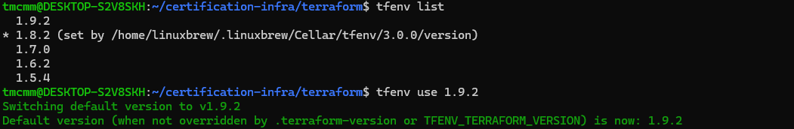
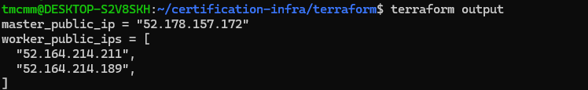
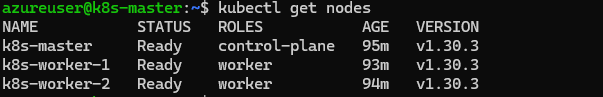

# Terraform-Azure
Repository for a quick environment creation for Certification CKA,CKAD,CKS study.

## What is Terraform?
Terraform is a tool for building, changing, and versioning infrastructure safely and efficiently. Terraform can manage existing and popular service providers as well as custom in-house solutions.

Configuration files describe to Terraform the components needed to run a single application or your entire datacenter. Terraform generates an execution plan describing what it will do to reach the desired state, and then executes it to build the described infrastructure. As the configuration changes, Terraform is able to determine what changed and create incremental execution plans which can be applied.

The infrastructure Terraform can manage includes low-level components such as compute instances, storage, and networking, as well as high-level components such as DNS entries, SaaS features, etc.

The key features of Terraform are:
__Infrastructure as Code__
Infrastructure is described using a high-level configuration syntax. This allows a blueprint of your datacenter to be versioned and treated as you would any other code. Additionally, infrastructure can be shared and re-used.

__Execution Plans__
Terraform has a "planning" step where it generates an execution plan. The execution plan shows what Terraform will do when you call apply. This lets you avoid any surprises when Terraform manipulates infrastructure.

__Resource Graph__
Terraform builds a graph of all your resources, and parallelizes the creation and modification of any non-dependent resources. Because of this, Terraform builds infrastructure as efficiently as possible, and operators get insight into dependencies in their infrastructure.

__Change Automation__
Complex changesets can be applied to your infrastructure with minimal human interaction. With the previously mentioned execution plan and resource graph, you know exactly what Terraform will change and in what order, avoiding many possible human errors.

__Files:__<br>
- main.tf: This is the primary Terraform configuration file where the main infrastructure components are defined. It typically includes resource declarations for creating and managing Azure resources like Virtual Machines, Resource Groups, and Network Interfaces. In this project, it also configures the Azure provider and specifies modules for creating the Kubernetes master and worker nodes.
- variables.tf: This file is used to declare the input variables for your Terraform configuration. It defines the variables that will be used throughout the Terraform scripts, such as vm_name, vm_size, and storage_account_name. These variables allow you to parameterize your configuration and make it reusable. <br>
- output-tf: This file defines the outputs of the Terraform configuration. Outputs are useful for returning information about the resources created, such as public IP addresses of the virtual machines or Kubernetes cluster details. Outputs can be queried using the terraform output command and can be used to provide information to other systems or Terraform configurations.
- provider.tf: Configures the provider settings.
- terraform.tfstate: Keeps track of the resource sta

**Install Terraform env to manage different Terraform**
[versions](https://github.com/tfutils/tfenv)

**Install any version off Terraform that you want:**
```
# If you use a .terraform-version file, tfenv install (no argument) will install the version written in it.

tfenv install latest
```

## PRE-REQUISITES:
__List your account Subscription ID:__
```
az account list -o table | grep 'subs_name' | awk '{print $ 3}'
```
__Create SP for deploying terraform objects:__
```
az ad sp create-for-rbac --name terraform --role="Contributor" --scopes="/subscriptions/$SUBS_ID" >> sp-credentials-terraform.yaml 2>&1
```
__Export your service principal credentials. Replace the placeholders with appropriate values from your service principal created above:__
```
export TF_VAR_client_id=<service-principal-appid> 
export TF_VAR_client_secret=<service-principal-password>
```

### Setup a container blob storage to upload the join script so that workers can join the cluster:

```

az group create --name terraform-state-rg \
    --location northeurope

az storage account create \
    --name terraformkubeadm \
    --resource-group terraform-state-rg \
    --location your_location \
    --sku Standard_LRS

az storage container create \
    --account-name terraformkubeadm \
    --name kubeadm

STORAGE_ACCOUNT_KEY=$(az storage account keys list \
    --resource-group terraform-state-rg \
    --account-name terraformkubeadm \
    --query '[0].value' \
    --output tsv)
```
**Expose these variables as variables that will be ingested by Terraform:**
```
####################################### TERRAFORM VARIABLES ############
export TF_VAR_client_id=""
export TF_VAR_client_secret=""
export TF_VAR_subscription_id=""
export TF_VAR_tenant_id=""
export TF_VAR_storage_account_key=""
########################################################################
```
**Create an sshkey value pair:**
```
ssh-keygen -o -t rsa -b 4096 -C "email@microsoft.com"
```

### (OPTIONAL) Set up an Azure blob storage to store Terraform state: <br>

Terraform tracks state locally via the terraform.tfstate file. This pattern works well in a single-person environment. In a multi-person environment, Azure storage is used to track state. You can also track the state locally. <br>

In this section, you see how to do the following tasks:<br>

1. Retrieve storage account information (account name and account key)<br>
2. Create a storage container into which Terraform state information will be stored.<br>
3. In the Azure portal, select All services in the left menu.<br>

4. Select Storage accounts.<br>

5. On the Storage accounts tab, select the name of the storage account into which Terraform is to store state. For example, you can use the storage account created when you opened Cloud Shell the first time. The storage account name created by Cloud Shell typically starts with cs followed by a random string of numbers and letters. Take note of the storage account you select. This value is needed later.<br>

6. On the storage account tab, select Access keys.<br>

```
az group create --name terraform-state-rg \
    --location northeurope

az storage account create \
    --name terraformkubeadm \
    --resource-group terraform-state-rg \
    --location your_location \
    --sku Standard_LRS
  
STORAGE_ACCOUNT_KEY=$(az storage account keys list \
    --resource-group terraform-state-rg \
    --account-name terraformkubeadm \
    --query '[0].value' \
    --output tsv)

az storage container create \
    --account-name terraformkubeadm \
    --name tfstate

```
### Create the Kubernetes cluster
In this section, you see how to use the terraform init command to create the resources defined in the configuration files you created in the previous sections.
You can initialize terraform on the command line passing the backend configuration as folows:
```
terraform init
(if using container to store tf state):
terraform init -backend-config="storage_account_name=<YourAzureStorageAccountName>" -backend-config="container_name=tfstate" -backend-config="access_key=<YourStorageAccountAccessKey>" -backend-config="key=codelab.microsoft.tfstate" 
```

**You can also put these under the file provider.tf:**
```
terraform {
  required_version = ">= 1.7.0"
  required_providers {
    azurerm = {
      source  = "hashicorp/azurerm"
      # version = "3.103.1"
    }
  }
    backend "azurerm" {
      resource_group_name  = ""
      storage_account_name = ""
      container_name       = "tfstate"
      access_key = "FCJh9BztuY4/xxxxxxx"
      key = "codelab.microsoft.tfstate" 
    }

}

provider "azurerm" {
  subscription_id = var.subscription_id
  # Tenant Id for the terraform SP
  tenant_id       = var.tenant_id
  features {
    resource_group {
      prevent_deletion_if_contains_resources = false
   }
  }
}
```
**Then run:**
```
terraform plan -out out.plan
terraform apply out.plan
```

### Access the Cluster
```
terraform output
```

```
ssh azureuser@masterpublicIP
kubectl label node worker-1 node-role.kubernetes.io/worker=worker
kubectl label node worker-2 node-role.kubernetes.io/worker=worker
```


!!! Note "Note"
        There you have a kubeadm cluster deployed on Azure ready for your exercises.

### Destroy the environment
Remember to destroy any resources you create once you are done with this tutorial. Run the destroy command and confirm with yes in your terminal.
```
terraform destroy
```


