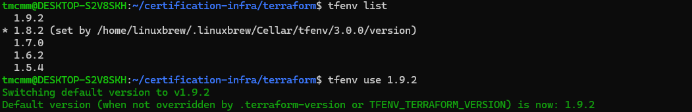
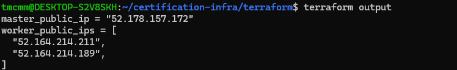
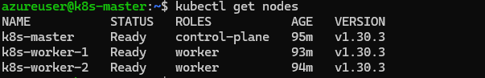

# Terraform-Azure

### Repository for a quick environment creation for Certification CKA,CKAD,CKS study.

## What is Terraform?
Terraform is an open-source Infrastructure as Code (IaC) tool developed by HashiCorp. It enables users to define and provision data center infrastructure using a declarative configuration language. By writing configuration files, you can describe the desired state of your infrastructure, and Terraform will manage the creation and maintenance of these resources across various cloud providers and services.

The key features of Terraform are: <br>

__Infrastructure as Code__
- Infrastructure as Code (IaC): Utilizes HashiCorp Configuration Language (HCL) to define infrastructure in human-readable, declarative configuration files.

__Execution Plans__
- Generates an execution plan that previews the changes Terraform will make before applying them, ensuring transparency and predictability.

__Resource Graph__
- Builds a graph of all resources, enabling efficient creation and management by understanding resource dependencies.

__Change Automation__
- Automatically determines and applies only the necessary changes to reach the desired state, minimizing manual interventions..

__Main Configuration Files:__

- main.tf: Contains the primary configuration code, defining the resources and their properties. <br>
- variables.tf: Declares input variables to parameterize configurations, enhancing reusability and flexibility. <br>
- output-tf: Specifies output values to be displayed after applying configurations, often used to share data between modules or as informative outputs. <br>
- provider.tf: Defines the providers (e.g., AWS, Azure, Google Cloud) that Terraform will interact with to provision resources. <br>
- terraform.tfstate: Keeps track of the resource state. <br>
-terraform.tfvars: Provides default values for variables, allowing for customization of configurations without altering the main code.

> Note: These files collectively enable the modular and organized management of infrastructure, promoting best practices in infrastructure provisioning and maintenance.


**Install Terraform env to manage different Terraform**
[versions](https://github.com/tfutils/tfenv)

**Install any version off Terraform that you want:**
```
# If you use a .terraform-version file, tfenv install (no argument) will install the version written in it.

tfenv install latest
```

## PRE-REQUISITES:
__List your account Subscription ID:__
```
az account list -o table | grep 'YOUR_SUBSCRIPTION_NAME' | awk '{print $ 3}'
```
__List your tenant:__
```
az account show --subscription "YOUR_SUBSCRIPTION_NAME" --query tenantId
```
__Create Service Principal with Contributor role at subscription for deploying terraform objects:__

```
SUBS_ID=$(az account show --query id --output tsv)
az ad sp create-for-rbac --name terraform --role="Contributor" --scopes="/subscriptions/$SUBS_ID" >> sp-credentials-terraform.yaml 2>&1
(The service principal will be created and the output will be redirected to sp-credentials-terraform.yaml file locally so then you can export the variables of Service Principal).
```
__Confirm that the Service Principal was created:__
```
 az ad sp list --show-mine --query "[].{name: appDisplayName, id:appId, tenant:appOwnerOrganizationId}"
```

### Setup a container blob storage to upload the join script so that workers can join the cluster:

> Note: Storage Account names are unique across Azure so make sure you use your own as the one in example **terraformkubeadm** is already taken
```
az group create --name terraform-state-rg \
    --location northeurope

az storage account create \
    --name terraformkubeadm \
    --resource-group terraform-state-rg \
    --location your_location \
    --sku Standard_LRS \
    --allow-shared-key-access true

az storage container create \
    --account-name terraformkubeadm \
    --name kubeadm

STORAGE_ACCOUNT_KEY=$(az storage account keys list \
    --resource-group terraform-state-rg \
    --account-name terraformkubeadm \
    --query '[0].value' \
    --output tsv)
```
**Expose these variables as variables that will be ingested by Terraform:**
```
####################################### TERRAFORM VARIABLES ############
 export HISTCONTROL=ignorespace
 echo "This command won't appear in history"
 export TF_VAR_client_secret=""
 export TF_VAR_storage_account_key=""
export TF_VAR_client_id=""
export TF_VAR_subscription_id=""
export TF_VAR_tenant_id=""
export TF_VAR_mypublic_ip=$(curl -s ifconfig.io)
export TF_VAR_storage_account_name=""
export TF_VAR_container_name=""
########################################################################
```
**Create an sshkey value pair:**
```
ssh-keygen -o -t rsa -b 4096 -C "email@microsoft.com"
```

### (OPTIONAL) Set up an Azure blob storage to store Terraform state: <br>

Terraform tracks state locally via the terraform.tfstate file. This pattern works well in a single-person environment. In a multi-person environment, Azure storage is used to track state. You can also track the state locally. <br>

In this section, you see how to do the following tasks:<br>

1. Retrieve storage account information (account name and account key)<br>
2. Create a storage container into which Terraform state information will be stored.<br>
3. In the Azure portal, select All services in the left menu.<br>

4. Select Storage accounts.<br>

5. On the Storage accounts tab, select the name of the storage account into which Terraform is to store state. For example, you can use the storage account created when you opened Cloud Shell the first time. The storage account name created by Cloud Shell typically starts with cs followed by a random string of numbers and letters. Take note of the storage account you select. This value is needed later.<br>

6. On the storage account tab, select Access keys.<br>

```
az group create --name terraform-state-rg \
    --location northeurope

az storage account create \
    --name terraformkubeadm \
    --resource-group terraform-state-rg \
    --location your_location \
    --sku Standard_LRS
  
STORAGE_ACCOUNT_KEY=$(az storage account keys list \
    --resource-group terraform-state-rg \
    --account-name terraformkubeadm \
    --query '[0].value' \
    --output tsv)

az storage container create \
    --account-name terraformkubeadm \
    --name tfstate

```
### Create the Kubernetes cluster
In this section, you see how to use the terraform init command to create the resources defined in the configuration files you created in the previous sections.
You can initialize terraform on the command line passing the backend configuration as folows:
```
terraform init
(if using container to store tf state):
terraform init -backend-config="storage_account_name=<YourAzureStorageAccountName>" -backend-config="container_name=tfstate" -backend-config="access_key=<YourStorageAccountAccessKey>" -backend-config="key=codelab.microsoft.tfstate" 
```

**You can also put these under the file provider.tf:**
```
terraform {
  required_version = ">= 1.7.0"
  required_providers {
    azurerm = {
      source  = "hashicorp/azurerm"
      # version = "3.103.1"
    }
  }
    backend "azurerm" {
      resource_group_name  = ""
      storage_account_name = ""
      container_name       = "tfstate"
      access_key = "FCJh9BztuY4/xxxxxxx"
      key = "codelab.microsoft.tfstate" 
    }

}

provider "azurerm" {
  subscription_id = var.subscription_id
  # Tenant Id for the terraform SP
  tenant_id       = var.tenant_id
  features {
    resource_group {
      prevent_deletion_if_contains_resources = false
   }
  }
}
```
**Then run:**
```
terraform plan -out out.plan
terraform apply out.plan
```

### Access the Cluster
```
terraform output
```

```
ssh azureuser@masterpublicIP
kubectl label node k8s-worker-1 node-role.kubernetes.io/worker=worker
kubectl label node k8s-worker-2 node-role.kubernetes.io/worker=worker
```



> Note: There you have a kubeadm cluster deployed on Azure ready for your exercises.

### Destroy the environment
Remember to destroy any resources you create once you are done with this tutorial. Run the destroy command and confirm with yes in your terminal.
```
terraform destroy
```


